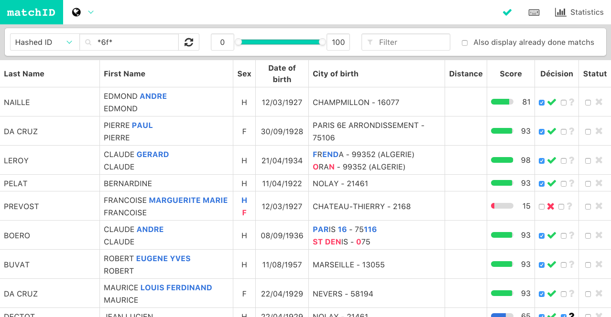
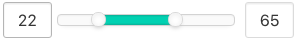
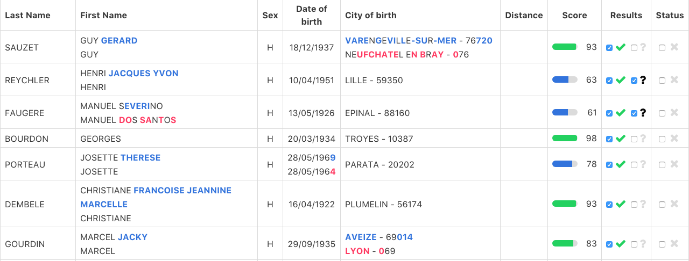

This repository is part of a wider project called *matchID* (to be fully released soon).

### :squirrel: about *matchID* :squirrel:

 *matchID* aims at helping developers (and organizations) to match people's identities, a kind of [dedupe library](https://github.com/dedupeio/dedupe) but focused mainly on people.

Two main applications :
- **link a database** filled with people informations **to another database** also filled with people informations
- **remove duplicate people** from a database

> *matchID* is developed by [@rhanka](https://github.com/rhanka) and [@SuperKiwi](https://github.com/SuperKiwi) who is part of the ["Entrepreneur d'Intérêt Général" 2017 program](https://www.etalab.gouv.fr/entrepreneurs-dinteret-general), a French presidential program aiming to bring tech people into working for an administration for a 10 month period — inspired by Obama's [Presidential Innovation Fellows (PIF)](https://pif.gov/).

# *matchID validation*

The goal of this repository (the *validation* sub-project) is to provide an user-friendly interface to display matching results of *matchID-backend* (to be released soon).

**It allows users to easily visualize matchs between people.**

Main used technologies are **VueJs** and **ElasticSearch**.
> An **elasticsearch instance running is mandatory** to make this application work



------

------

## Contents

* [Installation](#installation)
  * [Requirements](#requirements)
  * [Elastichsearch](#elasticsearch)
  * [Repository](#repository)
* [Quick Tour](#quick-tour)
  * [Navbar](#navbar)
  * [Controller](#controller)
  * [Data Table](#data-table)
* [Configuration](#configuration)
  * [Elasticsearch settings](#elasticsearch-settings)
  * [Columns](#columns)
  * [Custom functions](#custom-functions)
  * [Custom style](#custom-style)
  * [Validation](#validation)
  * [Scores](#scores)
  * [Json view](#json-view)
  * [Random Hash](#random-hash)
  * [Localization](#localization)
* [Keyboard shortcuts](#keyboard-shortcuts)

------

------

## Installation

------

### Requirements

- a recent version of `node`
- a recent version of `npm` or `yarn`
- a recent version (> `5.x`) version of `elasticsearch`

------

### Elasticsearch

To install and configure elasticsearch on your server or localhost, please follow [official guidelines](https://www.elastic.co/guide/en/elasticsearch/reference/current/_installation.html)

> Note sure about the minimum required version of `elasticsearch` which is needed. We used `5.x` versions to develop *matchID*

------

### Repository

```shell
git clone https://github.com/eig-2017/matchID-validation.git
cd matchID-validation
yarn -OR- npm install

cp -r matchIdConfig.example matchIdConfig
```

And once, your [configuration](#configuration) has been set, use `yarn run dev` (or `npm run dev`)

------

------

## Quick tour

------

### Navbar


**There are four different parts in the navbar:**

-  *Change the language of your app*

-  /  *Green check or Red cross if connection to Elasticsearch is working*

-  *Keyboard shortcuts cheatsheet*

-  *Statistics on processed matchs*

------

### Table Controller


**There are also four parts in the controller :**

-  *Query we are sending to Elasticsearch*

-  *Range filter if you have a score column on your datasets*

-  *Filter through results from Elasticsearch with text filtering*

-  *Filter through results from Elasticsearch depending on the fact that a match has been already processed or not*

------

### Data Table



> Please note that all data displayed here is dummy randomized data

The data table lists all different matchs found by *matchID backend*. Except the two columns *Results* and *Status*, all other **columns can be customized**.

> #### Generally speaking, many things can be customized to your needs in *matchID validation*

- *Results* column are pre-computed results according to the score (displayed in the previous column). In this example:
  - if the *score* is ajsonbove 55, the first checkbox (`validation_decision`) will be set to `true`
  - if the *score* is between 40 and 65, the question mark checkbox (`validation_indecision`) will be set to `true`
- *Status* column is checked to true once you consider that the results (`validation_decision` and `validation_indecision`) are correct

------

------


## Configuration

------

### Elasticsearch

Your data mapping should look like this (names and types are fully customizable) :
```json
{
  "properties": {
    "hashed_hexadecimal": {
      "type": "text",
      "store": true    
    },
    "last_name_1": {
      "type": "text",
      "store": true
    },
    "last_name_2": {
      "type": "text",
      "store": true    
    },
    "first_name_1": {
      "type": "text",
      "store": true
    },
    "first_name_2": {
      "type": "text",
      "store": true    
    },  
    "date_of_birth_1": {
      "type": "text",
      "store": true
    },
    "date_of_birth_2": {
      "type": "text",
      "store": true    
    },
    "...": {
      "...": "..."
    },
    "...": {
      "...": "..."
    },
    "distance_between_birth_cities": {
      "type": "long",
      "store": true
    },
    "score": {
      "type": "long",
      "store": true
    },
    "...": {
      "...": "..."
    },
    "...": {
      "...": "..."
    },
    "validation_decision": {
      "type": "text",
      "fielddata": true
    },
    "validation_done": {
      "type": "long",
      "store": true
    }
  }
}
```

A few notes :
- Concerning `validation_decision`, `validation_done` and optional `validation_indecision`, you can either keep field as a `text` with `"fielddata": true` or just set field as `long` (more in [Validation](#validation))
- `hashed_hexadecimal` will be explain in [Random Hash](#random-hash)

A row example for the previous set up would be :

| hashed_hexadecimal | last_name_1 | last_name_2 | first_name_1        | first_name_2   | date_of_birth_1 | date_of_birth_2 | score | valdation_decision | validation_done |
|:-------------------|:------------|:------------|:--------------------|:---------------|:----------------|:----------------|:------|:-------------------|:----------------|
| a2f34aeb3d777f82   | Grenier     | Grenier     | Martin Jorge Robert | Martin Georges | 04-03-1989      | 03-04-1989      | 68    | null               | null            |

------

### Columns

If we keep the above example, your [columns.json](./matchIdConfig.example/json/columns.json) should look like this :

```json
[
  {
    "field": "hashed_hexadecimal",
    "label": "Hashed Id",
    "display": false,
    "searchable": true
  },
  {
    "field": ["last_name_1", "last_name_2"],
    "label": "Last Name",
    "display": true,
    "searchable": true,
    "callBack": "coloredDiff"
  },
  {
    "field": ["first_name_1", "first_name_2"],
    "label": "First Name",
    "display": true,
    "searchable": true,
    "callBack": "coloredDiff"
  },
  {
    "field": ["date_of_birth_1", "date_of_birth_2"],
    "label": "Date of Birth",
    "display": true,
    "searchable": true,
    "callBack": "formatDate",
    "appliedClass": {
      "head": "head-centered",
      "body": "has-text-centered"
    }
  },
  {
    "field": "distance_cities_of_birth",
    "label": "Distance",
    "display": true,
    "searchable": false,
    "callBack": "formatDistance",
    "appliedClass": {
      "head": "head-centered",
      "body": "has-text-centered"
    }
  },
  {
    "field": "score",
    "label": "Score",
    "display": true,
    "searchable": true,
    "type": "score",
    "appliedClass": {
      "head": "head-centered",
      "body": "has-text-centered min-column-width-100"
    }
  }
]

```

Mandatory sub-fields : `field`, `label`, `display`, `searchable`.

**Some rules :**
- every displayed column (means it has a column in data table) can be searchable or not.
- you can (or not) add a callBack function to every displayed column (see [custom functions](#custom-functions))
- you can (or not) add classes (that will be applied to head's cell or body's cell) - you will define your custom classes in [custom.scss](./matchIdConfig.example/scss/custom.scss) (see [here](#custom-style))
- every scale of numbers that you want to display using a progress bar needs to have the following attribute : `"type": "score"`

------

### Custom functions

You can (and you should) set up custom functions in [formatCell.js](./matchIdConfig.example/js/formatCell.js).
Those functions will be used as callbacks (as defined above in [Columns](#columns)) for every cell in data table.

> Do not forget to declare your functions inside the `export default` declaration.

------

### Custom style

You can add your custom style to columns of cells by declaring your classes inside [custom.scss](./matchIdConfig.example/scss/custom.scss).

Just apply them inside `appliedClass` in `columns.json` config file.

> [Bulma](http://bulma.io/) is the CSS framework used

------

### Validation

You can decide to remove validation by setting `"display": false` in [validation.json](./matchIdConfig.example/json/validation.json).

```json
{
  "display": true,
  "action": {
    "label": "Results",
    "indecision_display": true
  },
  "done": {
    "label": "Status"
  }
}
```

If you enable validation, you need to define labels for both `action` and `done` fields.

If you set `"indecision_display"` to `true`, a question-mark checkbox will allow you to describe **indecision** concerning the match.

------

### Scores

Let's check what's inside [scores.json](./matchIdConfig.example/json/scores.json) :

```json
{
  "column": "score",
  "range": [0, 100],
  "colors": {
    "success": 80,
    "info": 60,
    "warning": 30,
    "danger": 0
  },
  "statisticsInterval" : 10,
  "preComputed": {
    "decision": 55,
    "indecision": [40, 65]
  }
}
```

In this example, we have score that range from 0 to 100.

We set up colors for different range (in this example, the color of progress bar will be `success` if score is above `80`, `info` if score is between `60` and `80` and so on).

The preComputed field allows matchID-validation to prefill decision and indecision columns according to scores. In this example, if score is above 55, `validation_decision` will be set to true ; and if score is between `40` and `65`, `validation_indecision` will be set to true.

------

### Json View

Let's check what's inside [view.json](./matchIdConfig.example/json/view.json) :

```json
{
  "display": true,
  "column_name": "View",
  "fields": {
    "operation": "excluded",
    "names": ["distance_cities_of_birth"]
  }
}
```

If you set `display` to true, it will add a column on the left of your table with a call-to-action. When clicking it, it will open a pop-up with all informations concerning the row.

Good to know :
- you can set `operation` field to `excluded` or `included`
- all columns listed in `names` fields will be excluded/included to Json View (*of course, `names` can be an empty array `[]`*)

------

### Random Hash

Let's check what's inside [randomId.json](./matchIdConfig.example/json/randomId.json) :

```json
{
  "characters": "abcdef0123456789",
  "length": 2,
  "prefix": "*",
  "suffix": "*",
  "default_search_field": "hashed_hexadecimal"
}
```

The `default_search_field` will be the default field/used to query elasticsearch.

On this field, we will search for a **random** 2-`length` word (composed of following `characters`) with `*` as `prefix` and `suffix`. _Example : \*a4\*_

------

### Localization

You can add several languages by customizing  [lang.json](./matchIdConfig.example/json/lang.json) file.

------

------

## Keyboard Shortcuts

`Ctrl`+ `Alt` will enable/disable the shortcuts.

Once enabled, the following ones are available :
- `a` will change the pre-computed decision (`validation_decision`)
- `e` will change the pre-computed indecision (`validation_indecision`)
- `i` will randomly reload the data
- `d` will show/hide a json view of row's data
- `Arrow UP` and `Arrow DOWN` allow you to move between rows
